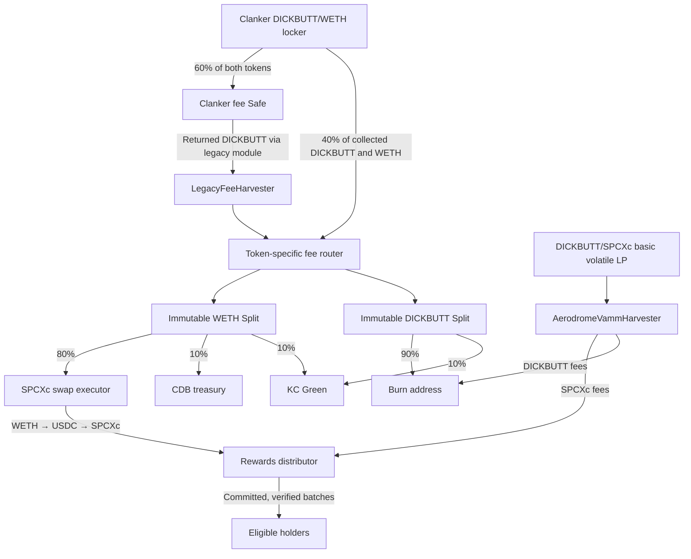

# DICKBUTT holder rewards

Current local candidate uses **basic volatile vAMM ERC-20 LP tokens** through `AerodromeVammHarvester`. See [setup and custody steps](AERODROME-SETUP.md). This adapter is not deployed, the actual new pool is not yet recorded, and launch prerequisites remain outstanding. The final internal [audit and testing report](AUDIT_REPORT.md) records eight fixed findings across the two September 20 passes; 238 JavaScript and 163 Solidity tests passed, with one optional historical NFT skip. Historical reports below describe earlier candidates and are not production approval.

Production targets **Base mainnet (8453)** and the **DICKBUTT** token, with separately selected production owner and bot wallets. The Sepolia deployment is a test deployment. The actual Aerodrome vAMM pool must be known before deploying its harvester; ERC-20 LP custody may be handed over later. See [production deployment intent](docs/COMPLETE-DEVELOPER-REPORT.md) and [the staged vAMM setup](AERODROME-SETUP.md).

Historical September 13 work: read the [complete developer report](docs/COMPLETE-DEVELOPER-REPORT.md), [file-by-file change inventory](docs/FILE-CHANGE-INVENTORY.md) and [historical test results](docs/TEST-RESULTS.md). Nine fix groups are documented. Four public testnet fee cycles and one holder round have completed, including a reviewed swap-only recovery after an RPC interruption. The RPC cause, observation gaps, unfinished 48-hour test and production prerequisites remain documented limitations. Mainnet launch is not approved.


Trading fees fund SPCXc rewards for DICKBUTT holders. Holders receive payments in their wallets; they do not claim or sign. The repository contains contracts, a time-weighted reward calculator, execution tools and a disposable deployment rehearsal.

The current design uses **actual Splits PushSplit V2.2 contracts** for fee allocations and an **unstaked basic volatile DICKBUTT/SPCXc ERC-20 LP position**. It includes returned legacy Clanker DICKBUTT fees. Mainnet ownership and creator authority have not been transferred by this project work.

## Fee flow



The Clanker locker deducts 60% of both token sides, but its **separate legacy fee module returns DICKBUTT to the creator**. With both paths operational, the pipeline can receive effectively all collected DICKBUTT and 40% of collected WETH. This corrects the earlier assessment that treated the locker deduction as the final creator entitlement. Upstream Safe/module controls and successful collection remain dependencies. [Legacy source, addresses and authority](docs/LEGACY-FEES.md).

Allocations apply to amounts reaching the pipeline. Ten percent of each of two different fee tokens is not a 20% share of their combined value. Splits retains tiny raw-unit balances and rounds recipient allocations down; dust stays at the Split and rolls into future distributions. Transferring DICKBUTT to the burn address does not call the token's supply-burn function. [Exact Splits behavior](docs/SPLITS-INTEGRATION.md).

The CDB treasury receives WETH on Base. Bridging and buying CryptoDickbutts NFTs remain manual.

## Components

| Component | Responsibility |
| --- | --- |
| `src/LockerHarvester.sol` | Permissionless collection from the owned Clanker locker to a configured receiver; timelocked destination changes and optional permanent freeze. |
| `src/LegacyFeeHarvester.sol` | Permissionless DICKBUTT recovery from both verified current/historical fee Safes to the fixed receiver. Requires a separate legacy creator-authority handoff. |
| `src/SplitsFeeRouter.sol` | Creates two immutable upstream PushSplits through the official factory and forwards each token to its correct Split. No custom percentage-transfer implementation. |
| `src/SpcxcSwapExecutor.sol` | Swaps the WETH allocation to SPCXc using a fixed two-hop route, capped size, deadline, approved keeper and a price floor refreshed by a narrow floor-setter role above an owner bound. |
| `src/AerodromeVammHarvester.sol` | Holds basic volatile ERC-20 LP; claims its fee share, burns DICKBUTT and forwards SPCXc. |
| `src/AerodromeFeeHarvester.sol` | Historical Slipstream NFT adapter, retained for existing rehearsal/testnet manifests. |
| `src/DickbuttRewardsDistributor.sol` | Reserves proposed/active obligations and pushes proof-verified rewards, allowing failed recipients to be retried. Bot proposer bounded by a share cap, rate limit, timelock and guardian pause. |
| `calculator/` | Finalized time-weighted balances, eligibility, accrual, Merkle plans and immutable journal. |
| `keeper/` and `script/run-keeper.mjs` | Verifies journal/configuration/commitments, handles proposals and timelocks, submits unpaid batches and closes completed rounds. |
| `operations/` | Fee-cycle orchestration, price-floor refresh, keyless monitoring, the operating schedule, deployment manifests and read-only preflight. |
| `ui/` | Local control console: the flow diagram, the launch checklist, the mainnet addresses and the operating commands, all resolved from the files above. |

`FeeSplitter.sol` is the earlier custom splitter, retained for regression tests. New deployments use `SplitsFeeRouter` plus `SpcxcSwapExecutor`. Foundry builds `src/`.

## Pool and aggregator intent

Use a **basic volatile DICKBUTT/SPCXc** pool. The selected expected fee remains 0.3%; actual funding and starting price require verification. The intended alternative route is USDC → SPCXc → DICKBUTT. Aggregators choose based on executable price, depth, fees, gas and supported routes; pool creation cannot force their routing. Additional liquidity may improve competitiveness against the deeper WETH route.

The basic factory reports fees in basis points: 30 is 0.3%. Fee settings may change. Verify the actual pool, fee, registered factory and unstaked LP balance. [Setup and inspection](AERODROME-SETUP.md).

That rewards pool is **not** the swap route. Converting the WETH allocation uses the existing two-hop **WETH → USDC → SPCXc** path, because the only direct WETH/SPCXc pool is shallow and quotes worse at the same size. The executor encodes tick spacings rather than pool addresses, so `npm run preflight` confirms both hops still resolve to the intended pools and hold liquidity. [Route evidence and re-quoting](docs/REHEARSAL.md#swap-route).

## Reward policy and authority

The calculator defaults to a 6.9M DICKBUTT time-weighted minimum. `WEIGHTING` must explicitly choose `linear` or `sqrt`; rehearsal uses linear. Square-root weighting increases the aggregate reward weight of balances split among qualifying wallets. Pools, burn addresses, treasury and operational contracts need explicit exclusions. Small allocations accrue until they reach the payout threshold. [Calculator configuration and recovery](calculator/README.md).

Harvesting, token routing, activation after the timelock and closing a fully paid round are permissionless. **Swaps and payouts require an approved keeper; each payout root requires a proposer.** Normal operation needs no multisig signature: bots propose, activate and pay, and the multisig acts only as guardian to cancel a pending round or pause proposals.

The proposer cannot directly call keeper-only payouts. The standard keeper independently reconstructs holder eligibility and amounts from historical chain data before signing; copied journal hashes alone are insufficient. On-chain proof checks enforce the committed root, not fair allocation. The selected deployment uses zero extra review delay, a 50% round cap, a six-hour minimum proposal interval and a guardian pause for future proposals. The constructor retains a 24-hour default until the owner explicitly changes it; zero removes the guaranteed cancellation window. The owner can appoint keepers and propose roots, so administrative authority remains broader than the bot roles. Keep the keeper code/configuration/RPC independently controlled and review multisig ownership. The floor setter is limited by the owner's lower bound; it is not an independent price oracle. [Roles and operating limits](docs/GOVERNANCE.md).

Gas is funded externally. No WETH gas deduction exists. Freezing fee destinations does not remove downstream proposer, price-floor or issuer dependencies.

## Control console

`npm run console` opens a local panel over the same files everything else reads: the fee flow
resolved per network, the launch checklist, the Base mainnet addresses, and the operating commands
with streamed output. `config/console-deployment.json` selects the manifest, calculator and journal used by the testnet view and operation defaults. The supplied selector points to the current new deployment.

```sh
npm run console                       # read-only: reads, dry runs and the local rehearsal
npm run console -- --allow-execute    # additionally permits the commands that sign and broadcast
```

It binds to loopback, mints a per-session token, and spawns commands from a fixed registry without a
shell. It reads no private key; the child CLIs load their own, and the console reports only whether a
variable is set. Checklist items that derive from configuration cannot be ticked by hand, so the
picture cannot drift from `config/base-mainnet.json`. [Console notes and security model](ui/README.md).

## Rehearse locally

Prerequisites: Node 18+, `npm ci`, and Foundry binaries. `FORGE_BIN` and `ANVIL_BIN` override the default `~/.foundry/bin` paths.

```sh
npm ci
npm test
forge test
BASE_RPC_URL=https://mainnet.base.org npm run rehearse
```

The runner starts its own loopback Anvil fork with chain ID 31337, builds/deploys the architecture, uses the **genuine Splits factory/implementation/Warehouse**, and mocks fee-source contracts and assets. It harvests all sources, routes fees, swaps, runs the real calculator, proposes a round, tests the timelock and a blocked recipient, retries, closes and reconciles. It saves addresses, transaction hashes, journal and results in a unique `.context/rehearsal-run-*` directory and stops its node afterward. No signing wallet connects to mainnet. [Scope, evidence and public-testnet preparation](docs/REHEARSAL.md).

Actual Clanker, legacy module and native SPCXc/real-route checks are separate fork tests. Native SPCXc is a **Base B20 precompile**, so use Base's compatible Foundry for those tests; changing ordinary Foundry's EVM version does not add B20 support. [Base tooling](https://github.com/base/base-anvil/tree/base-anvil-fork).

## Operate a rehearsal deployment

Build artifacts first. Use a reviewed deployment manifest for fees and the exact calculator configuration JSON for the keeper. Commands are read-only unless `--execute` is supplied; transaction execution is restricted to local chain 31337 or Base Sepolia 84532.

```sh
npm run preflight -- --config config/base-mainnet.json
npm run inspect:legacy
npm run floor -- --config deployment.json --monitor
npm run fees -- --config deployment.json
npm run keeper -- --config calculator-config.json --journal ./data
# Only on an explicitly configured rehearsal chain:
npm run fees -- --config deployment.json --execute
npm run keeper -- --config calculator-config.json --journal ./data --execute --propose
# Rerun after the timelock to deliver/retry and close:
npm run keeper -- --config calculator-config.json --journal ./data --execute
```

The intended production arrangement uses four bot roles on separate hosts: keeper (fees, payouts), ops (price floor, under the executor's floor-setter role), proposer (`--propose-only`, which refuses to start where the keeper key exists) and a keyless monitor. The fee cycle skips and names any source whose custody handoff has not happened yet, so the rollout can be staged. `npm run schedule` renders systemd units or a crontab from one validated definition, and `npm run monitor` is the keyless watchdog that catches an expired floor, an unfunded bot, a guardian pause or a root the calculator journal never produced. [Runbook](docs/RUNBOOK.md).

The swap price floor expires within one day. `npm run floor` refreshes it with an **ops key that is not a keeper**, on separate infrastructure, and its `--monitor` mode alerts before expiry without loading any key. [Price-floor bot](docs/PRICE-FLOOR.md).

Set `RPC_URL` everywhere, `KEEPER_PRIVATE_KEY` on the keeper host, `OPS_PRIVATE_KEY` on the ops host and `PROPOSER_PRIVATE_KEY` on the proposer host. Run the calculator once with `--bootstrap` at launch if round 1 should measure from launch rather than from the token's genesis. Keep fee cycles and keeper runs sequential for a signer. The CLI enforces a shared process lock and checks pending transactions; unresolved transaction markers require receipt reconciliation. Use scheduler alerts for nonzero exit status, unpaid recipients and stale price floors. [Keeper behavior](docs/KEEPER.md).

## Deploy to Base Sepolia

`npm run deploy:sepolia` deploys the architecture to Base Sepolia and emits the address manifest and the exact calculator configuration the operating CLIs consume. Splits V2.2 is deployed there at the same addresses as mainnet, so the fee fan-out uses the **genuine protocol**; Aerodrome, the tokens and the fee sources are stand-ins. Role validation runs before the first transaction and rejects a keeper that shares a key with any administrative role.

```sh
cp config/roles-sepolia.example.json roles.json
RPC_URL=https://sepolia.base.org DEPLOYER_PRIVATE_KEY=0x… npm run deploy:sepolia -- --roles roles.json
```

[Full deployment and operating guide](docs/SEPOLIA.md).

For Base mainnet, `npm run deploy:mainnet` deploys these same six contracts against the real tokens,
Splits factory, Aerodrome router, Clanker locker and legacy module — no stand-ins. It is a dry run
until `--execute`, every production magnitude must be stated rather than defaulted, and it performs
no custody handoff: ownership is nominated for the multisig to accept, and the legacy claim, creator
authority, locker ownership and ERC-20 LP transfer stay manual. [Mainnet deployment](docs/MAINNET-DEPLOY.md).

## Before production

Complete recipient/multisig/keeper/floor-setter configuration, select and fund the actual vAMM pool/LP, verify all deployed source/destination addresses, confirm the calculator exclusion set covers every pool and pipeline address (`npm run preflight` checks it), decide the permanent legacy-adapter migration policy, and obtain an independent contract review. Rehearse the **separate** locker ownership, legacy creator and ERC-20 LP handoffs before performing any production handoff. Test the actual new pool's fee collection after creation. Public testnet receipts now exist for the new deployment; neither those nor local tests approve mainnet custody changes. [Review scope and remaining checks](AUDITOR-BRIEF.md).

## Current internal security review

See [AUDIT_REPORT.md](AUDIT_REPORT.md) and [audit-findings.json](audit-findings.json) for the 2026-09-20 candidate, repaired payout/monitoring failures, local evidence and remaining deployment prerequisites. `npm test` includes the separate audit regressions. `npm run rehearse -- --vamm` exercises signed transactions on a disposable local chain using mock assets and real forked Splits; native-token compatibility has separate fork suites. No production custody change or launch approval is implied.
