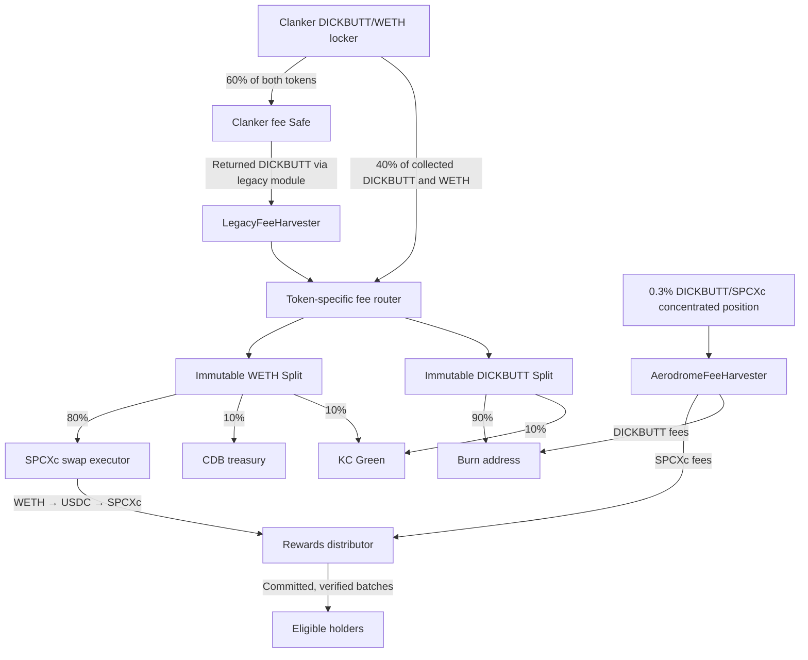

# DICKBUTT holder rewards

Trading fees fund SPCXc rewards for DICKBUTT holders. Holders receive payments in their wallets; they do not claim or sign. The repository contains contracts, a time-weighted reward calculator, execution tools and a disposable deployment rehearsal.

The current design uses **actual Splits PushSplit V2.2 contracts** for fee allocations and a **0.3% concentrated, full-range DICKBUTT/SPCXc position**. It includes returned legacy Clanker DICKBUTT fees. Mainnet ownership and creator authority have not been transferred by this project work.

## Fee flow



The Clanker locker deducts 60% of both token sides, but its **separate legacy fee module returns DICKBUTT to the creator**. With both paths operational, the pipeline can receive effectively all collected DICKBUTT and 40% of collected WETH. This corrects the earlier assessment that treated the locker deduction as the final creator entitlement. Upstream Safe/module controls and successful collection remain dependencies. [Legacy source, addresses and authority](docs/LEGACY-FEES.md).

Allocations apply to amounts reaching the pipeline. Ten percent of each of two different fee tokens is not a 20% share of their combined value. Splits retains tiny raw-unit balances and rounds recipient allocations down; dust stays at the Split and rolls into future distributions. Transferring DICKBUTT to the burn address does not call the token's supply-burn function. [Exact Splits behavior](docs/SPLITS-INTEGRATION.md).

The CDB treasury receives WETH on Base. Bridging and buying CryptoDickbutts NFTs remain manual.

## Components

| Component | Responsibility |
| --- | --- |
| `src/LockerHarvester.sol` | Permissionless collection from the owned Clanker locker to a configured receiver; timelocked destination changes and optional permanent freeze. |
| `src/LegacyFeeHarvester.sol` | Permissionless DICKBUTT recovery from both verified current/historical fee Safes to the fixed receiver. Requires a separate legacy creator-authority handoff. |
| `src/SplitsFeeRouter.sol` | Creates two immutable upstream PushSplits through the official factory and forwards each token to its correct Split. No custom percentage-transfer implementation. |
| `src/SpcxcSwapExecutor.sol` | Swaps the WETH allocation to SPCXc using a fixed two-hop route, capped size, deadline, owner floor and approved keeper. |
| `src/AerodromeFeeHarvester.sol` | Holds the concentrated LP NFT; burns its DICKBUTT fees and forwards its SPCXc fees. |
| `src/DickbuttRewardsDistributor.sol` | Reserves proposed/active obligations and pushes proof-verified rewards, allowing failed recipients to be retried. Bot proposer bounded by a share cap, rate limit, timelock and guardian pause. |
| `calculator/` | Finalized time-weighted balances, eligibility, accrual, Merkle plans and immutable journal. |
| `keeper/` and `script/run-keeper.mjs` | Verifies journal/configuration/commitments, handles proposals and timelocks, submits unpaid batches and closes completed rounds. |
| `operations/` | Fee-cycle orchestration, price-floor refresh/monitor, deployment manifests and read-only pool/configuration preflight. |

`FeeSplitter.sol` is the earlier custom splitter, retained for regression tests. New deployments use `SplitsFeeRouter` plus `SpcxcSwapExecutor`. Foundry builds `src/`; old root-level Solidity copies are not the deployment source.

## Pool and aggregator intent

Use a **0.3% concentrated full-range** position, with around $30k initial TVL as the stated liquidity target. The intended alternative route is USDC → SPCXc → DICKBUTT. Aggregators choose based on executable price, depth, fees, gas and supported routes; pool creation cannot force their routing. Additional liquidity may improve competitiveness against the deeper WETH route.

The selected factory maps tick spacing 200 to a 3000-unit base swap fee (0.3%). Its fee module can change the effective fee. Verify the pool's actual fee, factory generation and any unstaked fee rather than assuming spacing permanently fixes the rate. [Setup and inspection](AERODROME-SETUP.md).

That rewards pool is **not** the swap route. Converting the WETH allocation uses the existing two-hop **WETH → USDC → SPCXc** path, because the only direct WETH/SPCXc pool is shallow and quotes worse at the same size. The executor encodes tick spacings rather than pool addresses, so `npm run preflight` confirms both hops still resolve to the intended pools and hold liquidity. [Route evidence and re-quoting](docs/REHEARSAL.md#swap-route).

## Reward policy and authority

The calculator defaults to a 6.9M DICKBUTT time-weighted minimum. `WEIGHTING` must explicitly choose `linear` or `sqrt`; rehearsal uses linear. Square-root weighting increases the aggregate reward weight of balances split among qualifying wallets. Pools, burn addresses, treasury and operational contracts need explicit exclusions. Small allocations accrue until they reach the payout threshold. [Calculator configuration and recovery](calculator/README.md).

Harvesting, token routing, activation after the timelock and closing a fully paid round are permissionless. **Swaps and payouts require an approved keeper; each payout root requires a proposer.** Normal operation needs no multisig signature: bots propose, activate and pay, and the multisig acts only as guardian to cancel a pending round or pause proposals.

A stolen proposer key cannot move tokens — payment is keeper-gated and the keeper refuses any root its own journal did not produce. On-chain bounds limit the griefing it can do: a 24-hour timelock, at most 50% of the unreserved balance per round, 12 hours between proposals, and a guardian pause. Root correctness and exclusions remain off-chain governance decisions; a Merkle proof checks conformity to the root, not whether the root fairly represents holders. [Roles, bounds and the payout-schedule tradeoff](docs/GOVERNANCE.md).

Gas is funded externally. No WETH gas deduction exists. Freezing fee destinations does not remove downstream proposer, price-floor or issuer dependencies.

## Rehearse locally

Prerequisites: Node 18+, `npm ci`, and Foundry binaries. `FORGE_BIN` and `ANVIL_BIN` override the default `~/.foundry/bin` paths.

```sh
npm ci
npm test
forge test
BASE_RPC_URL=https://mainnet.base.org npm run rehearse
```

The runner starts its own loopback Anvil fork with chain ID 31337, builds/deploys the architecture, uses the **genuine Splits factory/implementation/Warehouse**, and mocks fee-source contracts and assets. It harvests all sources, routes fees, swaps, runs the real calculator, proposes a round, tests the timelock and a blocked recipient, retries, closes and reconciles. It saves addresses, transaction hashes, journal and results in a unique `.context/rehearsal-run-*` directory and stops its node afterward. No signing wallet connects to mainnet. [Scope, evidence and public-testnet preparation](docs/REHEARSAL.md).

Actual Clanker, legacy module and native SPCXc/real-route checks are separate fork tests. Native SPCXc is a **Base B20 precompile**, so use Base's compatible Foundry for those tests; changing ordinary Foundry's EVM version does not add B20 support. [Base tooling](https://github.com/base/base-anvil/tree/base-anvil-fork).

## Operate a rehearsal deployment

Build artifacts first. Use a reviewed deployment manifest for fees and the exact calculator configuration JSON for the keeper. Commands are read-only unless `--execute` is supplied; transaction execution is restricted to local chain 31337 or Base Sepolia 84532.

```sh
npm run preflight -- --config config/base-mainnet.json
npm run inspect:legacy
npm run floor -- --config deployment.json --monitor
npm run fees -- --config deployment.json
npm run keeper -- --config calculator-config.json --journal ./data
# Only on an explicitly configured rehearsal chain:
npm run fees -- --config deployment.json --execute
npm run keeper -- --config calculator-config.json --journal ./data --execute --propose
# Rerun after the timelock to deliver/retry and close:
npm run keeper -- --config calculator-config.json --journal ./data --execute
```

The swap price floor expires within one day. `npm run floor` refreshes it with an **ops key that is not a keeper**, on separate infrastructure, and its `--monitor` mode alerts before expiry without loading any key. [Price-floor bot](docs/PRICE-FLOOR.md).

Set `RPC_URL`, `KEEPER_PRIVATE_KEY` and, when separate, `OWNER_PRIVATE_KEY` in the environment. Keep fee cycles and keeper runs sequential for a signer. The CLI enforces a shared process lock and checks pending transactions; unresolved transaction markers require receipt reconciliation. Use scheduler alerts for nonzero exit status, unpaid recipients and stale price floors. [Keeper behavior](docs/KEEPER.md).

## Deploy to Base Sepolia

`npm run deploy:sepolia` deploys the architecture to Base Sepolia and emits the address manifest and the exact calculator configuration the operating CLIs consume. Splits V2.2 is deployed there at the same addresses as mainnet, so the fee fan-out uses the **genuine protocol**; Aerodrome, the tokens and the fee sources are stand-ins. Role validation runs before the first transaction and rejects a keeper that shares a key with any administrative role.

```sh
cp config/roles-sepolia.example.json roles.json
RPC_URL=https://sepolia.base.org DEPLOYER_PRIVATE_KEY=0x… npm run deploy:sepolia -- --roles roles.json
```

[Full deployment and operating guide](docs/SEPOLIA.md).

## Before production

Complete recipient/multisig/keeper configuration, select and fund the actual pool/NFT, verify all deployed source/destination addresses, decide the permanent legacy-adapter migration policy, and obtain an independent contract review. Rehearse the **separate** locker ownership, legacy creator and LP NFT handoffs before performing any production handoff. Test the actual new pool's fee collection after creation. A successful local rehearsal does not create a public-testnet deployment or approve mainnet custody changes. [Review scope and remaining checks](AUDITOR-BRIEF.md).
